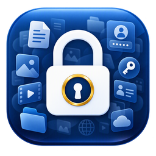

# المحفظة الآمنة — Secure Vault

**خزنتك الشخصية المشفّرة للملفات والحسابات الرقمية — على ويندوز وأندرويد والآيفون**
 
**Your personal encrypted vault for files and digital accounts — on Windows, Android and iPhone**

[العربية](#العربية) · [English](#english) · [سجل الإصدارات / Release history](#-سجل-الإصدارات--release-history)

---

## ⬇️ التنزيل — Download

| المنصة / Platform | الملف / File | الوصف | Description |
|---|---|---|---|
| 🪟 **Windows** | [**SecureVault-Setup-1.7.3.exe**](https://github.com/ssmm6000/SecureVault-Releases/releases/download/v1.7.3/SecureVault-Setup-1.7.3.exe) | النسخة المثبّتة (موصى بها) | Installed edition (recommended) |
| 🪟 **Windows** | [**SecureVault_Portable-1.7.3.zip**](https://github.com/ssmm6000/SecureVault-Releases/releases/download/v1.7.3/SecureVault_Portable-1.7.3.zip) | النسخة المحمولة: تعمل من فلاش أو هارد خارجي دون تثبيت | Portable: runs from a USB drive with no installation |
| 🤖 **Android** | [**SecureVault-Android-1.0.3-arm64.apk**](https://github.com/ssmm6000/SecureVault-Releases/releases/download/android-v1.0.3/SecureVault-Android-1.0.3-arm64.apk) | لأغلب الهواتف الحديثة | Most modern phones |
| 🤖 **Android** | [SecureVault-Android-1.0.3-arm32.apk](https://github.com/ssmm6000/SecureVault-Releases/releases/download/android-v1.0.3/SecureVault-Android-1.0.3-arm32.apk) | للهواتف القديمة | Older phones |
| 🤖 **Android** | [SecureVault-Android-1.0.3-universal.apk](https://github.com/ssmm6000/SecureVault-Releases/releases/download/android-v1.0.3/SecureVault-Android-1.0.3-universal.apk) | يعمل على أي هاتف (حجم أكبر) | Any phone (larger file) |
| 🍎 **iPhone** | [**SecureVault-iOS-1.0.3-unsigned.ipa**](https://github.com/ssmm6000/SecureVault-Releases/releases/download/ios-v1.0.3/SecureVault-iOS-1.0.3-unsigned.ipa) | يُثبَّت من الكمبيوتر عبر Sideloadly بحساب Apple ID مجاني ([الخطوات](#التثبيت)) | Installed from a PC with Sideloadly and a free Apple ID ([steps](#installation)) |

> تطبيقا أندرويد والآيفون في **إصدار تجريبي** — نرحّب بملاحظاتك. · The Android and iPhone apps are **preview releases** — feedback is welcome.

---

## العربية

### ما هي المحفظة الآمنة؟

**المحفظة الآمنة** برنامج يحفظ ملفاتك الخاصة وبيانات حساباتك الرقمية **مشفّرةً على جهازك أنت فقط** — لا خوادم، ولا حسابات سحابية، ولا يطّلع عليها أحد غيرك. لا يمكن فتح المحفظة إلا بالرمز السري الذي تختاره (أو ببصمتك على الهاتف).

### لماذا تستخدمها؟

- 📁 **إخفاء الملفات الخاصة:** مستندات شخصية، عقود، صور، فيديوهات، تسجيلات صوتية — أي نوع ملف.
- 🔑 **حفظ الحسابات الرقمية في مكان واحد:** اشتراكات البرامج والخدمات (مثل Microsoft 365 وAdobe وNetflix)، حسابات البريد الإلكتروني، مواقع التواصل، البنوك والمتاجر.
- 💻📱 **على الكمبيوتر والهاتف:** النسخة الاحتياطية من برنامج ويندوز تُفتح في تطبيقَي أندرويد والآيفون، والعكس.
- 🧳 **محمولة:** نسخة ويندوز المحمولة تعمل من فلاش ميموري على أي جهاز، وبياناتك معك على القرص نفسه.

### المزايا

| | ويندوز | أندرويد | آيفون |
|---|:---:|:---:|:---:|
| تشفير الملفات (أي نوع وأي حجم) | ✅ | ✅ | ✅ |
| الحسابات المحفوظة + مولّد كلمات مرور قوية | ✅ | ✅ | ✅ |
| مفتاح استرجاع عند نسيان الرمز السري | ✅ | ✅ | ✅ |
| قفل تلقائي بعد عدم الاستخدام | ✅ | ✅ | ✅ |
| نسخ احتياطي واسترجاع (متوافق بين الأجهزة الثلاثة) | ✅ | ✅ | ✅ |
| مشغّل فيديو وصوت مدمج | ✅ | — | — |
| السحب والإفلات لإضافة الملفات | ✅ | — | — |
| حذف الأصل بعد إضافته (إخفاؤه من الجهاز) | ✅ | ✅ | ✅ |
| إرجاع الملف تلقائياً إلى مجلده الأصلي | — | ✅ | ✅ |
| الدخول بالبصمة (Face ID في الآيفون) | — | ✅ | ✅ |
| منع لقطات الشاشة | — | ✅ | — |
| إخفاء المحتوى في قائمة التطبيقات المفتوحة | — | ✅ | ✅ |
| التحديث التلقائي من داخل البرنامج | ✅ | — | — |
| العربية والإنجليزية، الوضع الفاتح والداكن | ✅ | ✅ | ✅ |

### 🔐 الأمان والخصوصية

- **تشفير AES-256** لكل ملف، مع توقيع **HMAC-SHA256** يكشف أي تلف أو تلاعب.
- الرمز السري **لا يُخزَّن أبداً**؛ يُشتق منه مفتاح عبر **PBKDF2-SHA256 بـ 200,000 تكرار** لإبطاء محاولات التخمين.
- **مفتاح استرجاع** يُعرض مرة واحدة عند الإنشاء — الطريقة الوحيدة لفتح المحفظة إن نُسي الرمز. لا يوجد باب خلفي، ولا يستطيع المطوّر نفسه فتح محفظتك.
- **لا ترسل أي بيانات:** برنامج ويندوز يتصل بالإنترنت فقط ليقرأ رقم آخر إصدار من هذه الصفحة، وتطبيقا أندرويد والآيفون لا يتصلان بالإنترنت إطلاقاً.

### متطلبات التشغيل

- **ويندوز:** Windows 10 أو 11 (64-بت). لا يحتاج بايثون ولا أي برنامج إضافي.
- **أندرويد:** Android 7.0 أو أحدث.
- **آيفون:** iOS 15 أو أحدث، وكمبيوتر ويندوز للتثبيت عبر Sideloadly.

### التثبيت

**ويندوز — النسخة المثبّتة:** نزّل `SecureVault-Setup-<الإصدار>.exe` وشغّله. يُنشئ اختصاراً في قائمة ابدأ وسطح المكتب.

**ويندوز — النسخة المحمولة:** فك ضغط `SecureVault_Portable-<الإصدار>.zip` إلى أي مكان (فلاش مثلاً) وشغّل `SecureVault.exe`.

> - البرنامج يعمل **بصلاحيات المسؤول**: عند فتحه يظهر طلب ويندوز للسماح (UAC) — اضغط "نعم".
> - قد يظهر تحذير **Windows SmartScreen** لأن الملف غير موقّع رقمياً: اضغط "معلومات إضافية" ثم "تشغيل على أي حال".

**أندرويد:** نزّل ملف APK على الهاتف وافتحه، واسمح بالتثبيت من هذا المصدر عند السؤال. إن ظهرت رسالة عدم توافق فاستخدم ملف `universal`.

> **إن منع الهاتف التثبيت:** اضغط "تنزيل على أي حال" إن حذّر المتصفح · فعّل "السماح من هذا المصدر" · في Play Protect اختر "مزيد من التفاصيل" ← "التثبيت على أي حال" · في سامسونج أوقف "الحظر التلقائي" (Auto Blocker) مؤقتاً من الإعدادات ← الأمان والخصوصية.
>
> عند أول تشغيل يطلب التطبيق إذن الوصول إلى الصور والفيديو بنافذة أندرويد الرسمية — وافق عليه ليعمل إخفاء الصور وإرجاعها بشكل كامل.

> بعد إضافة الصور يعرض التطبيق حذف الأصل من الهاتف فتختفي من الاستديو، ويمكن إرجاعها لاحقاً إلى مجلدها الأصلي بأمر "إرجاع إلى مكانه الأصلي". الصور المرفوعة إلى Google Photos أو أي سحابة تُحذف من هناك يدوياً.

**آيفون (بحساب Apple ID مجاني):** ملف `.ipa` غير موقّع، ويوقّعه برنامج **Sideloadly** بحسابك أثناء التثبيت:
1. على كمبيوتر ويندوز ثبّت [Sideloadly](https://sideloadly.io)، ومعه **iTunes** و**iCloud** من موقع Apple (ليس من متجر مايكروسوفت).
2. وصّل الآيفون بكابل واضغط **"الوثوق بهذا الكمبيوتر"** على الآيفون.
3. اسحب ملف `SecureVault-iOS-<الإصدار>-unsigned.ipa` إلى Sideloadly، واكتب بريد Apple ID، ثم **Start**.
4. على الآيفون: الإعدادات ← عام ← **إدارة VPN والجهاز** ← حسابك ← **وثوق**.
5. iOS 16 فأحدث: الإعدادات ← الخصوصية والأمان ← **وضع المطوّر** ← تفعيل، ثم أعد تشغيل الآيفون.

> مع الحساب المجاني ينتهي التوقيع بعد **7 أيام**؛ أعد التثبيت من Sideloadly (أو فعّل التحديث التلقائي فيه)، وتبقى محفظتك كما هي.

### التحديث

- **ويندوز (1.5.0 فأحدث):** يظهر تنبيه داخل البرنامج عند صدور إصدار جديد، وزر **"تحديث الآن"** ينزّله ويثبّته تلقائياً ثم يعيد فتح البرنامج. يمكنك أيضاً الضغط على "التحقق من التحديثات".
- **الإصدارات الأقدم من 1.5.0:** نزّل الإصدار الجديد من هذه الصفحة وثبّته فوق القديم.
- **في كل الحالات تبقى محفظتك وملفاتك كما هي** عند الترقية.

---

## English

### What is Secure Vault?

**Secure Vault** keeps your private files and digital account details **encrypted on your own device only** — no servers, no cloud accounts, no one else can see them. The vault opens only with the secret PIN you choose (or your fingerprint on Android).

### Why use it?

- 📁 **Hide private files:** personal documents, contracts, photos, videos, voice recordings — any file type.
- 🔑 **Keep your digital accounts in one place:** software and service subscriptions (e.g. Microsoft 365, Adobe, Netflix), email accounts, social media, banking and shopping.
- 💻📱 **On your PC and your phone:** a backup from the Windows program opens in the Android and iPhone apps, and vice versa.
- 🧳 **Portable:** the Windows portable edition runs from a USB drive on any PC, with your data on the drive itself.

### Features

| | Windows | Android | iPhone |
|---|:---:|:---:|:---:|
| File encryption (any type, any size) | ✅ | ✅ | ✅ |
| Saved accounts + strong-password generator | ✅ | ✅ | ✅ |
| Recovery key if you forget your PIN | ✅ | ✅ | ✅ |
| Auto-lock when idle | ✅ | ✅ | ✅ |
| Backup & restore (compatible across all three) | ✅ | ✅ | ✅ |
| Built-in video and audio player | ✅ | — | — |
| Drag & drop to add files | ✅ | — | — |
| Delete the original after adding (hide it from the device) | ✅ | ✅ | ✅ |
| Restore a file automatically to its original folder | — | ✅ | ✅ |
| Fingerprint unlock (Face ID on iPhone) | — | ✅ | ✅ |
| Screenshot blocking | — | ✅ | — |
| Content hidden in the app switcher | — | ✅ | ✅ |
| Automatic in-app updates | ✅ | — | — |
| Arabic & English, light & dark mode | ✅ | ✅ | ✅ |

### 🔐 Security & privacy

- **AES-256 encryption** for every file, with an **HMAC-SHA256** signature that detects any damage or tampering.
- Your PIN is **never stored**; a key is derived from it with **PBKDF2-SHA256 (200,000 iterations)** to slow down guessing.
- A **recovery key** is shown once when you create the vault — the only way in if you forget your PIN. There is no back door; not even the developer can open your vault.
- **No data leaves your device:** the Windows program only goes online to read the latest version number from this page, and the Android and iPhone apps never go online at all.

### System requirements

- **Windows:** Windows 10 or 11 (64-bit). No Python or other software needed.
- **Android:** Android 7.0 or newer.
- **iPhone:** iOS 15 or newer, plus a Windows PC to install with Sideloadly.

### Installation

**Windows — installed edition:** download `SecureVault-Setup-<version>.exe` and run it. It adds Start Menu and desktop shortcuts.

**Windows — portable edition:** unzip `SecureVault_Portable-<version>.zip` anywhere (e.g. a USB drive) and run `SecureVault.exe`.

> - The program runs **as administrator**: Windows shows a permission prompt (UAC) when you open it — click "Yes".
> - **Windows SmartScreen** may warn because the file isn't digitally signed: click "More info" → "Run anyway".

**Android:** download the APK on your phone and open it; allow installs from this source when asked. If the phone reports it as incompatible, use the `universal` file.

> **If the phone blocks the install:** tap "Download anyway" if the browser warns · allow "Install from this source" · in Play Protect choose "More details" → "Install anyway" · on Samsung, temporarily turn off "Auto Blocker" in Settings → Security and privacy.
>
> On first launch the app asks for access to photos and videos through Android's official permission dialog — allow it so hiding and restoring photos works fully.

> After adding photos, the app offers to delete the originals so they disappear from your gallery; you can later put them back in their original folder with "Restore to original location". Photos backed up to Google Photos or another cloud must be deleted there manually.

**iPhone (free Apple ID):** the `.ipa` is unsigned; **Sideloadly** signs it with your account while installing:
1. On a Windows PC install [Sideloadly](https://sideloadly.io), plus **iTunes** and **iCloud** from Apple's website (not the Microsoft Store).
2. Connect the iPhone by cable and tap **"Trust This Computer"** on the iPhone.
3. Drag `SecureVault-iOS-<version>-unsigned.ipa` into Sideloadly, enter your Apple ID email, then **Start**.
4. On the iPhone: Settings → General → **VPN & Device Management** → your account → **Trust**.
5. iOS 16 or newer: Settings → Privacy & Security → **Developer Mode** → on, then restart the iPhone.

> With a free account the signature expires after **7 days**; reinstall from Sideloadly (or enable its auto-refresh) — your vault is kept.

### Updating

- **Windows 1.5.0 and newer:** a notice appears inside the program when a new version is out, and **"Update now"** downloads and installs it, then reopens the program. You can also click "Check for Updates".
- **Versions older than 1.5.0:** download the new version from this page and install it over the old one.
- **Your vault and files are always kept** when upgrading.

---

## 📜 سجل الإصدارات — Release history

### 🍎 iPhone

| الإصدار / Version | التاريخ / Date | الجديد | What's new | التنزيل / Download |
|---|---|---|---|---|
| [**1.0.3**](https://github.com/ssmm6000/SecureVault-Releases/releases/tag/ios-v1.0.3)  الأحدث · latest (تجريبي · preview) | 2026-10-05 | الإصدار الأول للآيفون: الملفات والصور، إخفاؤها من تطبيق الصور وإرجاعها، الحسابات، Face ID، نسخ احتياطي متوافق | First iPhone release: files & photos, hide from and restore to the Photos app, accounts, Face ID, compatible backups | [ipa](https://github.com/ssmm6000/SecureVault-Releases/releases/download/ios-v1.0.3/SecureVault-iOS-1.0.3-unsigned.ipa) |

### 🤖 Android

| الإصدار / Version | التاريخ / Date | الجديد | What's new | التنزيل / Download |
|---|---|---|---|---|
| [**1.0.3**](https://github.com/ssmm6000/SecureVault-Releases/releases/tag/android-v1.0.3)  الأحدث · latest (تجريبي · preview) | 2026-10-05 | طلب الأذونات الرسمية (الصور والفيديو، إدارة الوسائط، تسجيل البصمة)، وأيقونات شريط الحالة في الوضع الداكن | Official permission requests (photos & videos, media management, fingerprint enrollment), status-bar icons in dark mode | [arm64](https://github.com/ssmm6000/SecureVault-Releases/releases/download/android-v1.0.3/SecureVault-Android-1.0.3-arm64.apk) · [arm32](https://github.com/ssmm6000/SecureVault-Releases/releases/download/android-v1.0.3/SecureVault-Android-1.0.3-arm32.apk) · [universal](https://github.com/ssmm6000/SecureVault-Releases/releases/download/android-v1.0.3/SecureVault-Android-1.0.3-universal.apk) |
| [1.0.1](https://github.com/ssmm6000/SecureVault-Releases/releases/tag/android-v1.0.1) | 2026-10-05 | حذف الأصل بعد الإضافة فتختفي الصور من الاستديو، وإرجاع الملفات إلى مكانها الأصلي، وتحديد عدة ملفات | Delete originals after adding so photos leave the gallery, restore files to their original location, multi-select | [arm64](https://github.com/ssmm6000/SecureVault-Releases/releases/download/android-v1.0.1/SecureVault-Android-1.0.1-arm64.apk) · [arm32](https://github.com/ssmm6000/SecureVault-Releases/releases/download/android-v1.0.1/SecureVault-Android-1.0.1-arm32.apk) · [universal](https://github.com/ssmm6000/SecureVault-Releases/releases/download/android-v1.0.1/SecureVault-Android-1.0.1-universal.apk) |
| [1.0.0](https://github.com/ssmm6000/SecureVault-Releases/releases/tag/android-v1.0.0) | 2026-10-04 | الإصدار الأول: الملفات، الحسابات، البصمة، القفل التلقائي، نسخ احتياطي متوافق مع ويندوز | First release: files, accounts, fingerprint, auto-lock, backups compatible with Windows | [arm64](https://github.com/ssmm6000/SecureVault-Releases/releases/download/android-v1.0.0/SecureVault-Android-1.0.0-arm64.apk) · [arm32](https://github.com/ssmm6000/SecureVault-Releases/releases/download/android-v1.0.0/SecureVault-Android-1.0.0-arm32.apk) · [universal](https://github.com/ssmm6000/SecureVault-Releases/releases/download/android-v1.0.0/SecureVault-Android-1.0.0-universal.apk) |

### 🪟 Windows

| الإصدار / Version | التاريخ / Date | الجديد | What's new | التنزيل / Download |
|---|---|---|---|---|
| [**1.7.3**](https://github.com/ssmm6000/SecureVault-Releases/releases/tag/v1.7.3)  الأحدث · latest | 2026-10-05 | شريط عنوان النافذة داكن في الوضع الداكن (وبلون البرنامج على ويندوز 11) | Window title bar is dark in dark mode (matching the program on Windows 11) | [Setup](https://github.com/ssmm6000/SecureVault-Releases/releases/download/v1.7.3/SecureVault-Setup-1.7.3.exe) · [Portable](https://github.com/ssmm6000/SecureVault-Releases/releases/download/v1.7.3/SecureVault_Portable-1.7.3.zip) |
| [1.7.2](https://github.com/ssmm6000/SecureVault-Releases/releases/tag/v1.7.2) | 2026-10-04 | تنبيه تلقائي بالتحديثات مع زر "تحديث الآن" | Automatic update notice with an "Update now" button | [Setup](https://github.com/ssmm6000/SecureVault-Releases/releases/download/v1.7.2/SecureVault-Setup-1.7.2.exe) · [Portable](https://github.com/ssmm6000/SecureVault-Releases/releases/download/v1.7.2/SecureVault_Portable-1.7.2.zip) |
| [1.7.1](https://github.com/ssmm6000/SecureVault-Releases/releases/tag/v1.7.1) | 2026-10-04 | شريط التقدّم داخل نافذة البرنامج، ولا قفل أو إغلاق أثناء عملية جارية | Progress bar inside the main window; no auto-lock or closing mid-operation | [Setup](https://github.com/ssmm6000/SecureVault-Releases/releases/download/v1.7.1/SecureVault-Setup-1.7.1.exe) · [Portable](https://github.com/ssmm6000/SecureVault-Releases/releases/download/v1.7.1/SecureVault_Portable-1.7.1.zip) |
| [1.7.0](https://github.com/ssmm6000/SecureVault-Releases/releases/tag/v1.7.0) | 2026-10-04 | واجهة جديدة بشريط جانبي وبطاقات إحصاءات، والتشغيل بصلاحيات المسؤول | New interface with a sidebar and stats cards; runs as administrator | [Setup](https://github.com/ssmm6000/SecureVault-Releases/releases/download/v1.7.0/SecureVault-Setup-1.7.0.exe) · [Portable](https://github.com/ssmm6000/SecureVault-Releases/releases/download/v1.7.0/SecureVault_Portable-1.7.0.zip) |
| [1.5.0](https://github.com/ssmm6000/SecureVault-Releases/releases/tag/v1.5.0) | 2026-09-30 | تنزيل التحديث وتثبيته من داخل البرنامج مع التحقق من سلامة الملف | Download and install updates in-app, with file integrity checks | [Setup](https://github.com/ssmm6000/SecureVault-Releases/releases/download/v1.5.0/SecureVault-Setup-1.5.0.exe) · [Portable](https://github.com/ssmm6000/SecureVault-Releases/releases/download/v1.5.0/SecureVault_Portable-1.5.0.zip) |
| [1.4.2](https://github.com/ssmm6000/SecureVault-Releases/releases/tag/v1.4.2) | 2026-09-29 | أيقونة جديدة للبرنامج | New program icon | [Setup](https://github.com/ssmm6000/SecureVault-Releases/releases/download/v1.4.2/SecureVault-Setup-1.4.2.exe) · [Portable](https://github.com/ssmm6000/SecureVault-Releases/releases/download/v1.4.2/SecureVault_Portable-1.4.2.zip) |
| [1.4.1](https://github.com/ssmm6000/SecureVault-Releases/releases/tag/v1.4.1) | 2026-09-29 | إصلاح أزرار كانت تختفي على الشاشات المكبّرة، وتغيير الرمز السري أكثر أماناً | Fixed buttons hidden on scaled displays; safer PIN change | [Setup](https://github.com/ssmm6000/SecureVault-Releases/releases/download/v1.4.1/SecureVault-Setup-1.4.1.exe) · [Portable](https://github.com/ssmm6000/SecureVault-Releases/releases/download/v1.4.1/SecureVault_Portable-1.4.1.zip) |
| [1.4.0](https://github.com/ssmm6000/SecureVault-Releases/releases/tag/v1.4.0) | 2026-09-29 | لا يحتاج بايثون، مشغّل فيديو وصوت مدمج، أيقونات الملفات الأصلية | No Python needed, built-in video/audio player, original file icons | [Setup](https://github.com/ssmm6000/SecureVault-Releases/releases/download/v1.4.0/SecureVault-Setup-1.4.0.exe) · [Portable](https://github.com/ssmm6000/SecureVault-Releases/releases/download/v1.4.0/SecureVault_Portable-1.4.0.zip) |
| [1.2.1](https://github.com/ssmm6000/SecureVault-Releases/releases/tag/v1.2.1) | 2026-09-29 | أول إصدار منشور: زر التحقق من التحديثات، تشغيل النسخة المحمولة بنقرة | First published release: update check button, one-click portable launcher | [Setup](https://github.com/ssmm6000/SecureVault-Releases/releases/download/v1.2.1/SecureVault-Setup-1.2.1.exe) · [Portable](https://github.com/ssmm6000/SecureVault-Releases/releases/download/v1.2.1/SecureVault_Portable-1.2.1.zip) |

التفاصيل الكاملة لكل إصدار في صفحة **[الإصدارات / Releases](https://github.com/ssmm6000/SecureVault-Releases/releases)**.

---

## ©️ الحقوق — Copyright

**© 2026 سلطان السالمي. جميع الحقوق محفوظة.**

برنامج "المحفظة الآمنة" (لويندوز وأندرويد) من تطوير **سلطان السالمي**، وجميع حقوقه محفوظة له. لا يجوز نسخ البرنامج أو تعديله أو إعادة توزيعه أو بيعه أو نسبته لغير مطوّره دون إذن كتابي مسبق من المطوّر.

**© 2026 Sultan Al-Salmi. All rights reserved.**

"Secure Vault" (for Windows and Android) was developed by **Sultan Al-Salmi**, who holds all rights to it. You may not copy, modify, redistribute, sell, or claim authorship of this software without prior written permission from the developer.
